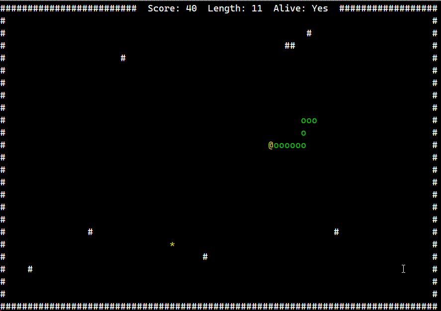

# AikaRTOS

<p align="center">
  
</p>

[](LICENSE)
[](#)
[](#)

AikaRTOS is a simple educational RTOS project originally targeting the STM32 NUCLEO-F411RE board, now also tested on the NUCLEO-H753ZI.

It is designed to explore basic task management, task scheduling, and memory allocation on embedded systems.

The project is written in **C++20**.

> **Note:** This is a purely educational project. 
> It was originally developed using a NUCLEO-F411RE board for experimentation purposes.
> Recently tested and confirmed to run on NUCLEO-H753ZI as well, though full multi-platform support is still a work in progress.

## Table of Contents
- [Features](#features)
- [Examples](#examples)
- [🎮 Snake Demo](#snake-demo)
- [FPU demo](#fpu-demo)
- [FPU demo 3](#fpu-demo-3)
- [License](#license)
- [Getting Started](#getting-started)
- [Build Requirements](#build-requirements)

---

## Features

- Basic task switching
- Multiple scheduler implementations (e.g., Round-Robin, Fixed Priority)
- Simple memory allocator implementations (e.g., bump, free list)
- Simple startup sequence
- Designed for STM32 Cortex-M4/M7 (tested on F411RE and H753ZI)
- Written in C++20

---

## Examples 

> All examples can be found in the [`aikartos/src/tests`](aikartos/src/tests) folder.


| Example | Description |
|------|-------------|
| [`round_robin.cpp`](aikartos/src/tests/round_robin.cpp) | Demonstrates basic Round-Robin task switching between three simple infinite loops. |
| [`edf.cpp`](aikartos/src/tests/edf.cpp) | Demonstrates Earliest Deadline First (EDF) scheduling with tasks having different deadlines. |
| [`fixed_priority.cpp`](aikartos/src/tests/fixed_priority.cpp) | Demonstrates Fixed Priority scheduling where tasks are executed based on static priorities. |
| [`lottery.cpp`](aikartos/src/tests/lottery.cpp) | Demonstrates Lottery Scheduling where tasks are chosen randomly based on ticket allocation. |
| [`priority_aging.cpp`](aikartos/src/tests/priority_aging.cpp) | Demonstrates Priority Scheduling with Aging to prevent starvation of low-priority tasks. |
| [`weighted_lottery.cpp`](aikartos/src/tests/weighted_lottery.cpp) | Demonstrates Weighted Lottery Scheduling where tasks have different chances of being selected based on weight. |
| [`stack_overflow.cpp`](aikartos/src/tests/stack_overflow.cpp) | Demonstrates system behavior when a stack overflow occurs in a task. Useful for testing robustness. |
| [`producer_consumer.cpp`](aikartos/src/tests/producer_consumer.cpp) | Demonstrates a simple Producer-Consumer system using a shared lock-free queue and cooperative task switching. |
| [`coop_preemptive.cpp`](aikartos/src/tests/coop_preemptive.cpp) | Demonstrates hybrid Cooperative-Preemptive scheduling where each task can have its own quantum or run cooperatively. |
| [`sch_cfs_like.cpp`](aikartos/src/tests/sch_cfs_like.cpp) | Demonstrates a CFS-like scheduler where tasks are selected based on the smallest virtual runtime to ensure balanced CPU time distribution.
| [`sch_mlfq.cpp`](aikartos/src/tests/sch_mlfq.cpp) | Demonstrates a Multilevel Feedback Queue scheduler with per-task quantum levels and automatic priority boosting. |
| [`memory_allocator_bump.cpp`](aikartos/src/tests/memory_allocator_bump.cpp) | Demonstrates a simple bump allocator used to manage memory in a linear fashion. |
| [`memory_allocator_free_list.cpp`](aikartos/src/tests/memory_allocator_free_list.cpp) | Demonstrates a basic free-list memory allocator with support for reuse and fragmentation handling. |
| [`memory_allocator_dlist.cpp`](aikartos/src/tests/memory_allocator_dlist.cpp) | Demonstrates a double-linked free-list allocator with bidirectional coalescing and minimal overhead on allocation. |
| [`memory_allocator_buddy.cpp`](aikartos/src/tests/memory_allocator_buddy.cpp) | Tests an arena-based buddy allocator (`buddy::impl::region`) that stores all metadata in external memory.|
| [`memory_allocator_buddy_fixed.cpp`](aikartos/src/tests/memory_allocator_buddy_fixed.cpp) | Tests a statically bounded buddy allocator (`buddy::impl::fixed`) with internal free list table.         |
| [`memory_allocator_tlsf.cpp`](aikartos/src/tests/memory_allocator_tlsf.cpp)         | Tests a dynamic TLSF allocator (`tlsf::impl::region`) that places bucket index tables inside the managed memory block. |
| [`memory_allocator_tlsf_fixed.cpp`](aikartos/src/tests/memory_allocator_tlsf_fixed.cpp) | Tests a statically sized TLSF allocator (`tlsf::impl::fixed`) with a fully internalized index table stored in `std::array`. |

---

## Snake Demo

[](#)

🎮🎮🎮

<p align="center">
  
</p>

A tiny cooperative Snake game demo running on AikaRTOS.
Implements movement via timer-driven tasks, showcasing clean task switching and input handling.

[`the_snake.cpp`](aikartos/src/tests/_the_snake.cpp)

## FPU demo

[](#)

<p align="center">
  
</p>

A small floating-point demo with smooth motion and fading trail.
Uses trigonometric FPU math and per-frame task updates to draw a glowing animated path in the console.
Demonstrates how one task can safely use the FPU while others do not, under a preemptive round-robin scheduler.

[`fpu_demo_01.cpp`](aikartos/src/tests/fpu_demo_01.cpp)


## FPU demo 3

<p align="center">
  
</p>

[`fpu_demo_03.cpp`](aikartos/src/tests/fpu_demo_03.cpp)

## License

This project is licensed under the [MIT License](LICENSE).

---

## Build Requirements

To build and run this project, you will need:

- **ARM toolchain** (e.g., `arm-none-eabi-gcc`, `arm-none-eabi-newlib`)
- **STM32Cube Firmware Package** for the selected platform (F4 or H7)  
  This includes the necessary device headers like `<stm32f4xx.h>` or `<stm32h7xx.h>` and low-level drivers.

> You can download the STM32Cube packages via:
>
> - [STM32CubeMX](https://www.st.com/en/development-tools/stm32cubemx.html)
> - [STM32CubeF4](https://www.st.com/en/embedded-software/stm32cubef4.html)
> - [STM32CubeH7](https://www.st.com/en/embedded-software/stm32cubeh7.html)

---

## Getting Started

### CMake-based build

This project is built using **CMake** and **Ninja**.

1. Clone the repository:

   ```bash
   git clone https://github.com/your-username/aikartos.git
   cd aikartos
  ```

2. Configure the build (an example):
  ```bash
  cmake -G "Ninja" -B build_f411 \
      -DCMAKE_TOOLCHAIN_FILE=gcc-arm-none-eabi.cmake \
      -DPLATFORM=f411 \
      -DCMSIS_DIRECTORY="C:/soft/ST/STM32Cube_FW_F4/STM32Cube_FW_F4_V1.28.0/Drivers/CMSIS"
  ```
3. Build 
  ```bash
  cd build_f411
  ninja
  ```

4. Flash using your preferred tool (e.g., ST-Link, OpenOCD, CubeProgrammer).

> Note: platform and paths must match your environment.  


